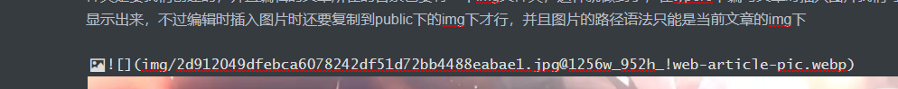

# 关于hexo无法显示图片的问题

根据网上的教程，下载插件和修改配置文_config.yaml使生成与新文章同名的文件夹存放一些资源，但是两个方法都没有完全成功解决，最终的结果就是只能显示在与_posts同级的文件夹img下的图片，并且只能是/img/图片名字 的路径才能在网站上显示，不仅如此图片格式还必须是PNG格式


---

2023-9-7更新

生成与新文章同名的文件夹存放一些资源，这个好像是typora的自动复制图片到同名文件夹的功能，图片好像也不知是只显示png图片格式

## 解决方案

<!--more-->

hexo的博客的结构好像是，会将public下的内容当作整个博客的根目录，所以图片显示正确，只要将要显示的图片放这个public的目录下的img文件夹，这个img文件夹是要我们创建的，并且编辑的文章所在的目录也要有一个img文件夹，这样就做到了，在typero下编写文章时插入图片我们可以看到，同时部署博客时也可以显示出来，不过编辑时插入图片时还要复制到public下的img下才行，并且图片的路径语法只能是当前文章的img下




## 部署到码云出现无样式

服了，码云上的根目录和这个hexo的根目录不一样，所以还要修改这个hexo的config.yml文件,添加并修改原来的内容为

```
url: https://gitee.com/lanceluot/blog.git
root: /blog
```

## 还有一个问题

越测试，遇到的坑越多

图片好像不能写成html标签的

```

```


只能写成markdown语法

```

```


---


## 又又又出问题了

部署到码云上，总是和本地部署的不一样，不知道为什么码云上的总是hello world为第一篇文章，我猜是布局样式的什么在使用hexo d命令时没更新，好在我修改首页标题和一些描述的信息，重新部署就好了，延迟太久啦，部署后还要等两三分钟刷新才出来，还以为又出现什么问题了
