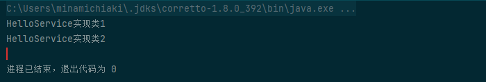
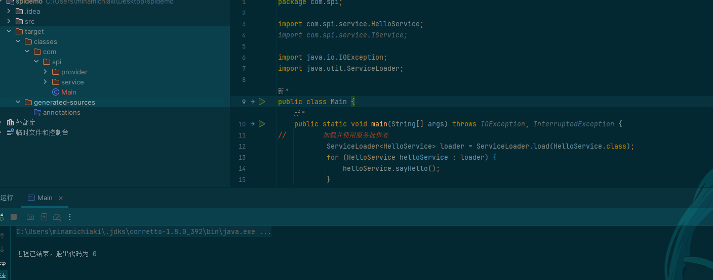

## java中的SPI机制

Java SPI机制是一种服务发现机制，其全称为Service Provider Interface。它允许为特定服务提供多个实现，然后通过配置文件等方式，在运行时自动探测和加载这些实现。SPI机制的好处在于，它可以使服务接口和实现类解耦，从而方便地扩展和替换服务的实现。

下面我们以JDBC（Java Database Connectivity）为例，来介绍如何使用Java SPI机制。JDBC是Java中用于连接和操作数据库的标准接口，不同的数据库厂商提供了各自的JDBC驱动实现。在SPI机制下，JDBC规范定义了一组接口，而具体的数据库驱动实现则由各个数据库厂商提供。

首先，我们需要定义一个服务接口，例如`HelloService`：

```java
public interface HelloService {
    void sayHello();
}
```

然后，在不同的jar包中提供该服务的实现，例如在`com.example.provider1`包中提供实现类`HelloServiceProvider1`，在`com.example.provider2`包中提供实现类`HelloServiceProvider2`。这些实现类都要实现`HelloService`接口。

<!-- more -->

接着，在每个实现类所在的jar包中，我们需要在`META-INF/services`目录下创建名为`com.example.HelloService`的文件。该文件的内容应该为提供该服务的实现类的全限定名，每行一个。例如：

```java
com.example.provider1.HelloServiceProvider1
com.example.provider2.HelloServiceProvider2
```

最后，我们可以通过如下代码来使用Java SPI机制加载和使用服务的实现类：

```java
import java.util.ServiceLoader;

public class SPIDemo {
    public static void main(String[] args) {
        // 加载并使用服务提供者
        ServiceLoader<HelloService> loader = ServiceLoader.load(HelloService.class);
        for (HelloService helloService : loader) {
            helloService.sayHello();
        }
    }
}
```

在运行`SPIDemo`类时，SPI机制会自动扫描classpath上的所有jar包，找到`META-INF/services`目录下的配置文件，并读取其中的服务提供者信息。然后，它会按顺序加载并实例化这些服务提供者，并返回一个迭代器，我们可以通过迭代这个迭代器来使用服务提供者的实现。

通过Java SPI机制，我们可以方便地实现服务接口和实现类的解耦，从而方便地扩展和替换服务的实现。而且，其实现方式也非常简单，只需要提供一个配置文件即可，不需要任何额外的代码和框架。因此，Java SPI机制被广泛应用于各种框架和组件，比如日志、ORM框架等。

## 实验-验证

新建一个接口：

```java
package com.spi.service;

public interface HelloService {
    void sayHello();
}
```

实现这个接口的不同类：

```java
package com.spi.provider;

import com.spi.service.HelloService;

public class HelloServiceImpl1 implements HelloService {

    @Override
    public void sayHello() {
        System.out.println("HelloService实现类1");
    }
}

package com.spi.provider;

import com.spi.service.HelloService;

public class HelloServiceImpl2 implements HelloService {
    @Override
    public void sayHello() {
        System.out.println("HelloService实现类2");
    }
}

```

Main.java:

```java
package com.spi;

import com.spi.service.HelloService;
import com.spi.service.IService;

import java.io.IOException;
import java.util.ServiceLoader;

public class Main {
    public static void main(String[] args) throws IOException, InterruptedException {
//         加载并使用服务提供者
            ServiceLoader<HelloService> loader = ServiceLoader.load(HelloService.class);
            for (HelloService helloService : loader) {
                helloService.sayHello();
            }

    }
}

```

运行结果：



需要注意的是

SPI机制会自动扫描classpath上的所有jar包，找到`META-INF/services`目录下的配置文件，并读取其中的服务提供者信息,所以idea右键运行时，要求这是个maven项目，这样才能构建编译实现类，不然单单只是一个普通项目，右键只会编译不会在类路径生成resourse文件夹也就没有接口实现类的配置文件，spi机制就会失效，输出的结果也就什么也没有毕竟都没有加载类，

即会出现如下情况：


