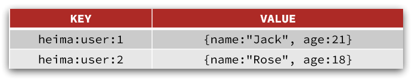
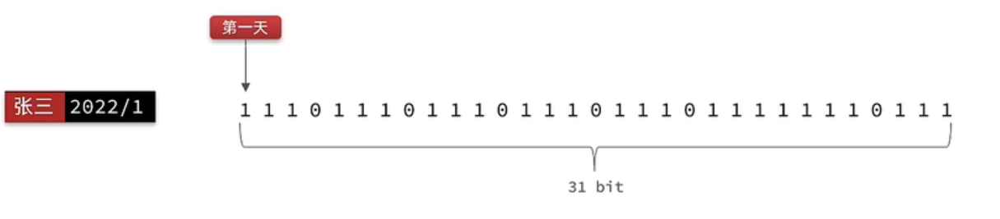

# 1.初识Redis

Redis是一种键值型的NoSql数据库，这里有两个关键字：

- 键值型

- NoSql

其中**键值型**，是指Redis中存储的数据都是以key、value对的形式存储，而value的形式多种多样，可以是字符串、数值、甚至json,而NoSql则是相对于传统关系型数据库而言，有很大差异的一种数据库。

<!-- more -->

## 1.1.认识NoSQL

**NoSql**可以翻译做Not Only Sql（不仅仅是SQL），或者是No Sql（非Sql的）数据库。是相对于传统关系型数据库而言，有很大差异的一种特殊的数据库，因此也称之为**非关系型数据库**。


### 1.1.1.结构化与非结构化

传统关系型数据库是结构化数据，每一张表都有严格的约束信息：字段名、字段数据类型、字段约束等等信息，插入的数据必须遵守这些约束,

而NoSql则对数据库格式没有严格约束，往往形式松散，自由。

可以是键值型也可以是文档型,

甚至可以是图格式

### 1.1.2.关联和非关联

传统数据库的表与表之间往往存在关联，例如外键,而非关系型数据库不存在关联关系，要维护关系要么靠代码中的业务逻辑，要么靠数据之间的耦合.

### 1.1.3.查询方式

传统关系型数据库会基于Sql语句做查询，语法有统一标准；

而不同的非关系数据库查询语法差异极大，五花八门各种各样。

### 1.1.4.事务

传统关系型数据库能满足事务ACID的原则。

而非关系型数据库往往不支持事务，或者不能严格保证ACID的特性，只能实现基本的一致性。


# 2.Redis常见命令

Redis是典型的key-value数据库，key一般是字符串，而value包含很多不同的数据类型：


## 2.1.Redis通用命令

通用指令是部分数据类型的，都可以使用的指令，常见的有：

- KEYS：查看符合模板的所有key
- DEL：删除一个指定的key
- EXISTS：判断key是否存在
- EXPIRE：给一个key设置有效期，有效期到期时该key会被自动删除
- TTL：查看一个KEY的剩余有效期

通过help [command] 可以查看一个命令的具体用法，例如：

```sh
# 查看keys命令的帮助信息：
127.0.0.1:6379> help keys

KEYS pattern
summary: Find all keys matching the given pattern
since: 1.0.0
group: generic
```

## 2.2.String类型

String类型，也就是字符串类型，是Redis中最简单的存储类型。

其value是字符串，不过根据字符串的格式不同，又可以分为3类：

- string：普通字符串
- int：整数类型，可以做自增、自减操作
- float：浮点类型，可以做自增、自减操作

不管是哪种格式，底层都是字节数组形式存储，只不过是编码方式不同。字符串类型的最大空间不能超过512m.

### 2.2.2.Key结构

Redis没有类似MySQL中的Table的概念，我们该如何区分不同类型的key呢？

例如，需要存储用户、商品信息到redis，有一个用户id是1，有一个商品id恰好也是1，此时如果使用id作为key，那就会冲突了，该怎么办？

我们可以通过给key添加前缀加以区分，不过这个前缀不是随便加的，有一定的规范：

Redis的key允许有多个单词形成层级结构，多个单词之间用':'隔开，格式如下：

```
	项目名:业务名:类型:id
```

这个格式并非固定，也可以根据自己的需求来删除或添加词条。这样以来，我们就可以把不同类型的数据区分开了。从而避免了key的冲突问题。

例如我们的项目名称叫 heima，有user和product两种不同类型的数据，我们可以这样定义key：

- user相关的key：**heima:user:1**

- product相关的key：**heima:product:1**


如果Value是一个Java对象，例如一个User对象，则可以将对象序列化为JSON字符串后存储：

| **KEY**         | **VALUE**                                  |
| --------------- | ------------------------------------------ |
| heima:user:1    | {"id":1,  "name": "Jack", "age": 21}       |
| heima:product:1 | {"id":1,  "name": "小米11", "price": 4999} |

并且，在Redis的桌面客户端中，还会以相同前缀作为层级结构，让数据看起来层次分明，关系清晰：


## 2.3.Hash类型

Hash类型，也叫散列，其value是一个无序字典，类似于Java中的HashMap结构。

String结构是将对象序列化为JSON字符串后存储，当需要修改对象某个字段时很不方便：




Hash结构可以将对象中的每个字段独立存储，可以针对单个字段做CRUD：


## 2.4.List类型

Redis中的List类型与Java中的LinkedList类似，可以看做是一个双向链表结构。既可以支持正向检索和也可以支持反向检索。

特征也与LinkedList类似：

- 有序
- 元素可以重复
- 插入和删除快
- 查询速度一般

常用来存储一个有序数据，例如：朋友圈点赞列表，评论列表等。


## 2.5.Set类型

Redis的Set结构与Java中的HashSet类似，可以看做是一个value为null的HashMap。因为也是一个hash表，因此具备与HashSet类似的特征：

- 无序

- 元素不可重复

- 查找快

- 支持交集、并集、差集等功能

# 3.Redis常见业务场景

## 3.1缓存

将需要大量重复访问的数据提前写入redis中，那么就可以降低访问数据库的次数，提升系统性能

## 3.2会话管理

redis可以用户记录用户登录状态，当后端校验用户名和密码正确后，生成一个token或登录凭证存入redis中，以后每次访问都先去redis中查找，这种用来取代session的做法有几个好处，1减少服务器的存储压力，2更容易的对服务器做水平扩展

## 3.3生成全局id

id要求为递增的时候，对于数据库表的自动增加生成id回受到数据库的单表大小容量限制，并且还要求id的增长规律不能太明显，为了增加ID的安全性，我们可以不直接使用Redis自增的数值，而是拼接一些其它信息：


ID的组成部分：符号位：1bit，永远为0

时间戳：31bit，以秒为单位，可以使用69年

序列号：32bit，秒内的计数器，支持每秒产生2^32个不同ID

### 3.3.1Redis实现全局唯一Id

```java
@Component
public class RedisIdWorker {
    /**
     * 开始时间戳
     */
    private static final long BEGIN_TIMESTAMP = 1640995200L;
    /**
     * 序列号的位数
     */
    private static final int COUNT_BITS = 32;

    private StringRedisTemplate stringRedisTemplate;

    public RedisIdWorker(StringRedisTemplate stringRedisTemplate) {
        this.stringRedisTemplate = stringRedisTemplate;
    }

    public long nextId(String keyPrefix) {
        // 1.生成时间戳
        LocalDateTime now = LocalDateTime.now();
        long nowSecond = now.toEpochSecond(ZoneOffset.UTC);
        long timestamp = nowSecond - BEGIN_TIMESTAMP;

        // 2.生成序列号
        // 2.1.获取当前日期，精确到天
        String date = now.format(DateTimeFormatter.ofPattern("yyyy:MM:dd"));
        // 2.2.自增长
        long count = stringRedisTemplate.opsForValue().increment("icr:" + keyPrefix + ":" + date);

        // 3.拼接并返回
        return timestamp << COUNT_BITS | count;
    }
}
```

## 3.4分布式锁

乐观锁,这里有个疑问，都已经使用乐观锁判断是否有资格购买了，为什么创建订单还要加锁,即这句话   “查询数据库，都不存在订单，所以我们还是需要加锁，但是乐观锁比较适合更新数据，而现在是插入数据，所以我们需要使用悲观锁操作”

```java
@Override
public Result seckillVoucher(Long voucherId) {
    // 1.查询优惠券
    SeckillVoucher voucher = seckillVoucherService.getById(voucherId);
    // 2.判断秒杀是否开始
    if (voucher.getBeginTime().isAfter(LocalDateTime.now())) {
        // 尚未开始
        return Result.fail("秒杀尚未开始！");
    }
    // 3.判断秒杀是否已经结束
    if (voucher.getEndTime().isBefore(LocalDateTime.now())) {
        // 尚未开始
        return Result.fail("秒杀已经结束！");
    }
    // 4.判断库存是否充足
    if (voucher.getStock() < 1) {
        // 库存不足
        return Result.fail("库存不足！");
    }
    // 5.一人一单逻辑
    // 5.1.用户id
 boolean success = seckillVoucherService.update()
            .setSql("stock= stock -1")
            .eq("voucher_id", voucherId).gt("stock",0); //where id = ? and stock > 0
    		.update()
    // 5.2.判断是否存在
    int count = query().eq("user_id", userId).eq("voucher_id", voucherId).count();
    if (count > 0) {
        // 用户已经购买过了
        return Result.fail("用户已经购买过一次！");
    }

    //6，扣减库存
    boolean success = seckillVoucherService.update()
            .setSql("stock= stock -1")
            .eq("voucher_id", voucherId).update();
    if (!success) {
        //扣减库存
        return Result.fail("库存不足！");
    }
    //7.创建订单
    //为什么下面这个方法还要加锁
    VoucherOrder voucherOrder = new VoucherOrder();
    // 7.1.订单id
    long orderId = redisIdWorker.nextId("order");
    voucherOrder.setId(orderId);

    voucherOrder.setUserId(userId);
    // 7.3.代金券id
    voucherOrder.setVoucherId(voucherId);
    save(voucherOrder);

    return Result.ok(orderId);

}
```

悲观锁

注入sync,lock等

### 3.2 、Redis分布式锁的实现核心思路

实现分布式锁时需要实现的两个基本方法：

* 获取锁：

	* 互斥：确保只能有一个线程获取锁
	* 非阻塞：尝试一次，成功返回true，失败返回false

* 释放锁：

	* 手动释放
	* 超时释放：获取锁时添加一个超时时间

	

核心思路：

我们利用redis 的setNx 方法，当有多个线程进入时，我们就利用该方法，第一个线程进入时，redis 中就有这个key 了，返回了1，如果结果是1，则表示他抢到了锁，那么他去执行业务，然后再删除锁，退出锁逻辑，没有抢到锁的哥们，等待一定时间后重试即可

## 3.4 统计访问次数

### UV统计-HyperLogLog

首先我们搞懂两个概念：

* UV：全称Unique Visitor，也叫独立访客量，是指通过互联网访问、浏览这个网页的自然人。1天内同一个用户多次访问该网站，只记录1次。
* PV：全称Page View，也叫页面访问量或点击量，用户每访问网站的一个页面，记录1次PV，用户多次打开页面，则记录多次PV。往往用来衡量网站的流量。

通常来说UV会比PV大很多，所以衡量同一个网站的访问量，我们需要综合考虑很多因素，所以我们只是单纯的把这两个值作为一个参考值

UV统计在服务端做会比较麻烦，因为要判断该用户是否已经统计过了，需要将统计过的用户信息保存。但是如果每个访问的用户都保存到Redis中，数据量会非常恐怖，那怎么处理呢？

Hyperloglog(HLL)是从Loglog算法派生的概率算法，用于确定非常大的集合的基数，而不需要存储其所有值。相关算法原理大家可以参考：https://juejin.cn/post/6844903785744056333#heading-0
Redis中的HLL是基于string结构实现的，单个HLL的内存**永远小于16kb**，**内存占用低**的令人发指！作为代价，其测量结果是概率性的，**有小于0.81％的误差**。不过对于UV统计来说，这完全可以忽略。

## 3.5消息队列

### 3.5.1 Redis消息队列-基于Stream的消息队列-消费者组

消费者组（Consumer Group）：将多个消费者划分到一个组中，监听同一个队列。具备下列特点：


创建消费者组：

key：队列名称
groupName：消费者组名称
ID：起始ID标示，$代表队列中最后一个消息，0则代表队列中第一个消息
MKSTREAM：队列不存在时自动创建队列
其它常见命令：

 **删除指定的消费者组**

```java
XGROUP DESTORY key groupName
```

 **给指定的消费者组添加消费者**

```java
XGROUP CREATECONSUMER key groupname consumername
```

 **删除消费者组中的指定消费者**

```java
XGROUP DELCONSUMER key groupname consumername
```

从消费者组读取消息：

```java
XREADGROUP GROUP group consumer [COUNT count] [BLOCK milliseconds] [NOACK] STREAMS key [key ...] ID [ID ...]
```

* group：消费组名称
* consumer：消费者名称，如果消费者不存在，会自动创建一个消费者
* count：本次查询的最大数量
* BLOCK milliseconds：当没有消息时最长等待时间
* NOACK：无需手动ACK，获取到消息后自动确认
* STREAMS key：指定队列名称
* ID：获取消息的起始ID：

">"：从下一个未消费的消息开始
其它：根据指定id从pending-list中获取已消费但未确认的消息，例如0，是从pending-list中的第一个消息开始

消费者监听消息的基本思路：

STREAM类型消息队列的XREADGROUP命令特点：

* 消息可回溯
* 可以多消费者争抢消息，加快消费速度
* 可以阻塞读取
* 没有消息漏读的风险
* 有消息确认机制，保证消息至少被消费一次

排行榜

限流

## 3.7位统计

#### 11.1、用户签到-BitMap功能演示

我们针对签到功能完全可以通过mysql来完成，比如说以下这张表


用户一次签到，就是一条记录，假如有1000万用户，平均每人每年签到次数为10次，则这张表一年的数据量为 1亿条

每签到一次需要使用（8 + 8 + 1 + 1 + 3 + 1）共22 字节的内存，一个月则最多需要600多字节

我们如何能够简化一点呢？其实可以考虑小时候一个挺常见的方案，就是小时候，咱们准备一张小小的卡片，你只要签到就打上一个勾，我最后判断你是否签到，其实只需要到小卡片上看一看就知道了

我们可以采用类似这样的方案来实现我们的签到需求。

我们按月来统计用户签到信息，签到记录为1，未签到则记录为0.

把每一个bit位对应当月的每一天，形成了映射关系。用0和1标示业务状态，这种思路就称为位图（BitMap）。这样我们就用极小的空间，来实现了大量数据的表示

Redis中是利用string类型数据结构实现BitMap，因此最大上限是512M，转换为bit则是 2^32个bit位。



BitMap的操作命令有：

* SETBIT：向指定位置（offset）存入一个0或1
* GETBIT ：获取指定位置（offset）的bit值
* BITCOUNT ：统计BitMap中值为1的bit位的数量
* BITFIELD ：操作（查询、修改、自增）BitMap中bit数组中的指定位置（offset）的值
* BITFIELD_RO ：获取BitMap中bit数组，并以十进制形式返回
* BITOP ：将多个BitMap的结果做位运算（与 、或、异或）
* BITPOS ：查找bit数组中指定范围内第一个0或1出现的位置

#### 11.2 、用户签到-实现签到功能

需求：实现签到接口，将当前用户当天签到信息保存到Redis中

思路：我们可以把年和月作为bitMap的key，然后保存到一个bitMap中，每次签到就到对应的位上把数字从0变成1，只要对应是1，就表明说明这一天已经签到了，反之则没有签到。

我们通过接口文档发现，此接口并没有传递任何的参数，没有参数怎么确实是哪一天签到呢？这个很容易，可以通过后台代码直接获取即可，然后到对应的地址上去修改bitMap。


