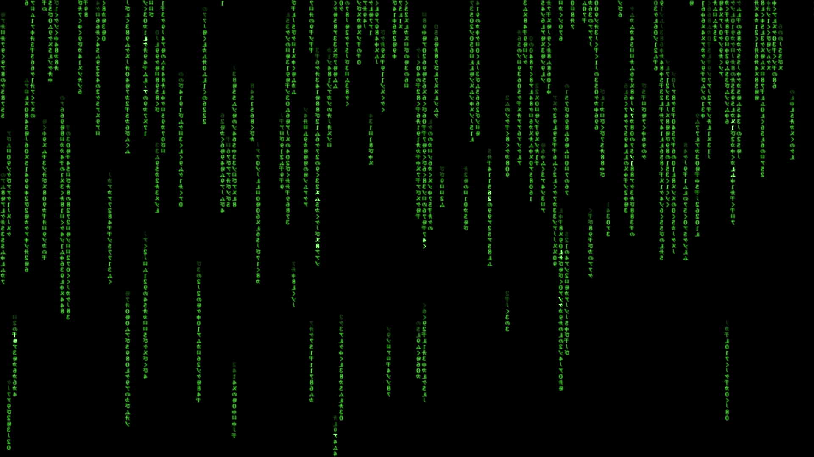

# shell编程开篇

最近学习shell脚本，于是今天想写一个自动执行屏幕保护程序的脚本

## 功能

在特定时间段内执行屏幕保护程序

<!--more-->

## 代码

```shell
#!/bin/bash

# 设置开始和结束时间
start_time="15:24"  # 设置开始时间，格式为HH:MM
end_time="16:00"    # 设置结束时间，格式为HH:MM

while true; do
    # 获取当前时间
    current_time=$(date +"%H:%M")

    # 比较当前时间是否在指定的时间范围内
    if [[ "$current_time" > "$start_time" ]] && [[ "$current_time" < "$end_time" ]]; then
        echo "当前时间在指定范围内，启动屏幕保护程序..."
        # 替换以下命令为你下载的屏幕保护程序的路径和名称
        start d:/matrix.scr -s &
    else
        echo "当前时间不在指定范围内，无需启动屏幕保护程序。"
    fi

    sleep 60  # 暂停60秒，等待下一次检查
done
```

## 效果



就类似黑客帝国那样的
