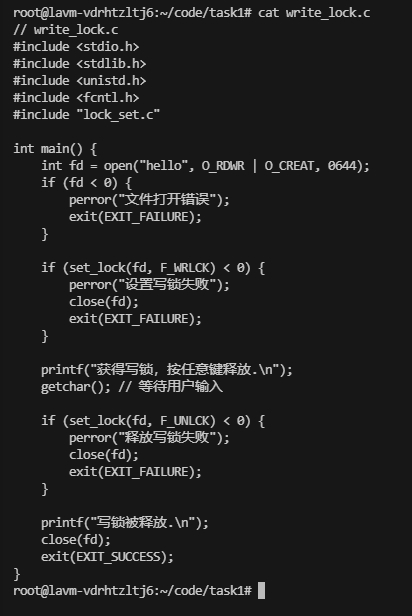
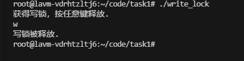
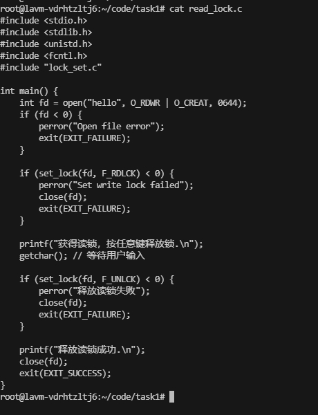
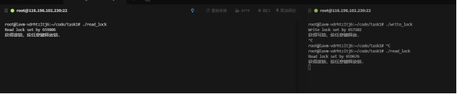
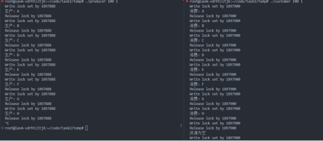

## 一、实验目的

### 1.掌握文件读写及上锁操作

### 2.掌握open()、read()、write()、fcntl()等函数的使用

 <!-- more -->

## 二、 **实验内容与设计思想**

### 1. 编写程序实现文件写入锁和读取锁的设置和运行

### 2. 编写程序使用文件操作，仿真FIFO（先进先出）结构以及生产者-消费者运行模型

### 3. 编程程序实现文件多路复用操作。

## **三、实验使用环境**

Ubuntu虚拟机

## 四、实验步骤和调试过程

### 1.文件写入锁和读取锁

1）编程lock_set.c实现文件记录锁功能

2）编写文件写入锁的测试用例write_lock.c：创建一个hello文件，之后对其上写入锁，键盘输入任意一个字符后解除写入锁。

Write_lock.c:

 

运行可执行文件,结果如下：

 

3）在两个终端上运行./write_lock，查看运行结果

在两个终端上运行如图：

 

4）编写文件读取锁的测试用例read_lock.c：创建一个hello文件，之后对其上读取锁，键盘输入任意一个字符后解除读取锁。

 

5）在两个终端上运行./read_lock，查看运行结果。

 

6）如果在一个终端上运行读取锁程序，在另一个终端上运行写入锁程序，会有什么结果？

写入锁程序会被阻塞，等待读取锁释放锁

 

### 2.文件操作仿真FIFO，实现生产者-消费者运行模型


1）编程实现生产者程序producer.c，创建仿真FIFO结构文件（普通文件），按照给定的时间间隔向FIFO文件写入自动生成的字符（自定义），生产周期及生产的资源数通过参数传递给进程。

Producer.c:

~~~c
#include <stdio.h>
#include <unistd.h>
#include <stdlib.h>
#include <string.h>
#include <fcntl.h>
#include "lock_set.c"
#define fifo_file "fifo_file.txt"
void produce(char* resource){
    int fd=open(fifo_file,O_CREAT|O_RDWR|O_APPEND,0644);
    if (fd < 0)
    {
        printf("打开文件错误\n");
        exit(1);
    }
    lock_set(fd,F_WRLCK);
    if (write(fd, resource, strlen(resource))< 0){
        printf("写入错误\n");
    }
    printf("生产：%s\n",resource);
    lock_set(fd,F_UNLCK);
    close(fd);
}
int main(int argc,char * argv[]){
    if(argc<3){
        printf("参数错误\n");
        exit(EXIT_FAILURE);
    }
    int second=atoi(argv[1]);
    int cnt=atoi(argv[2]);
    int idx=0;
    while(cnt--){
        char res[2];
        res[0]='A'+(idx%26);
        res[1]='\0';
        idx++;
        produce(res);
        //         printf("等待输入\n");
        // getchar();
        sleep(second);
    }
}


~~~

 

2）编程实现消费者程序customer.c，从文件中读取相应数目的字符并在屏幕上显示，然后从文件中删除刚才消费过的数据，可通过两次幅值来实现文件内容的偏移，每次消费的资源通过参数传递给进程。

Customer.c:

```c
#include <stdio.h>
#include <unistd.h>
#include <stdlib.h>
#include <string.h>
#include <fcntl.h>
#include "lock_set.c"
#define fifo_file "fifo_file.txt"
#define tmp_file "tmp.txt"
void custom(){
    int fd=open(fifo_file,O_RDWR,0644);
    if(fd<0){
        printf("文件打开错误\n");
        exit(EXIT_FAILURE);
    }
    lock_set(fd,F_WRLCK);
    char buf[2];
    int size=read(fd,buf,sizeof(buf)-1);
    if(size<0){
        printf("读取失败\n");
        close(fd);
        return;
    }
    else if(size==0){
        printf("资源为空\n");
        close(fd);
        return;
    }
    buf[size]='\0';
    printf("消费：%s\n",buf);
    int fd_tmp=open(tmp_file,O_RDWR|O_CREAT|O_TRUNC,0644);
    if(fd_tmp<0){
        printf("文件打开错误\n");
        exit(EXIT_FAILURE);
    }
    while(read(fd,buf,sizeof(buf)-1)>0){
        write(fd_tmp,buf,sizeof(buf)-1);
    };
    lseek(fd,0,SEEK_SET);
    lseek(fd_tmp,0,SEEK_SET);
    int idx=0;
    while(read(fd_tmp,buf,sizeof(buf)-1)){
        idx++;
        write(fd,buf,sizeof(buf)-1);
    };
    ftruncate(fd,idx);
    close(fd_tmp);
    lock_set(fd,F_UNLCK);
    close(fd);
    return;
}
int main(int argc,char* argv[]){
    int num,second;
    if(argc<3){
        printf("参数错误");
        exit(EXIT_FAILURE);
    }
    second=atoi(argv[1]);
    num=atoi(argv[2]);
    while(num--){
        custom();
        sleep(second);
    };
    exit(EXIT_SUCCESS);
}
```


3）在两个终端上分别运行生产者程序producer和消费者程序customer

运行结果：

 

 

### 3. 多路复用—I/O操作及阻塞


编程实现文件描述符集合的监听 

.multiplex_poll.c

```c
#include <stdio.h>
#include <stdlib.h>
#include <string.h>
#include <unistd.h>
#include <fcntl.h>
#include <sys/select.h>
#include <errno.h>
#define MAX_BUFFER_SIZE 1024
#define IN_FILES 3
#define TIME_DELAY 60
#define MAX(a, b) ((a > b) ? (a) : (b))
int main(void) {
    fd_set rfds;
    struct timeval tv;
    int retval, i, real_read, maxfd;
    int fds[IN_FILES];
    char buf[MAX_BUFFER_SIZE];
    FD_ZERO(&rfds);
    fds[0] = 0;
    if ((fds[1] = open("in1", O_RDONLY | O_NONBLOCK)) < 0) {
        printf("Open in1 error\n");
        return 1;
    }
    
    if ((fds[2] = open("in2", O_RDONLY | O_NONBLOCK)) < 0) {
        printf("Open in2 error\n");
        return 1;
    }

    maxfd = MAX(fds[0], MAX(fds[1], fds[2])) + 1;

    while (1) {
        FD_ZERO(&rfds);
        for (i = 0; i < IN_FILES; i++) {
            FD_SET(fds[i], &rfds);
        }

        tv.tv_sec = 0;
        tv.tv_usec = 0;

        retval = select(maxfd, &rfds, NULL, NULL, &tv);

        if (retval == -1) {
            perror("Select error");
            return 1;
        } else if (retval) {
            for (i = 0; i < IN_FILES; i++) {
                if (FD_ISSET(fds[i], &rfds)) {
                    memset(buf, 0, MAX_BUFFER_SIZE);
                    real_read = read(fds[i], buf, MAX_BUFFER_SIZE);
                    
                    if (real_read < 0) {
                        if (errno != EAGAIN) {
                            perror("Read error");
                            return 1;
                        }
                    } else if (real_read == 0) {
                        close(fds[i]);
                    } else {
                        if (i == 0) {
                            if ((buf[0] == 'q') || (buf[0] == 'Q')) {
                                return 1;
                            }
                        } else {
                            buf[real_read] = '\0';
                            printf("%s", buf);
                        }
                    }
                }
            }
        }
    }

    return 0;
}

```


运行时，需要打开3个虚拟终端，分别创建两个管道文件in1和in2，运行主程序

终端1：

```shell
mknod in1 p

cat >in1

MULTIPLEX CALL

TEST IN1

END
```


终端2：

```shell
mknod in2 p

multiplex call

test in2

end
```


终端3:

./multiplex_poll.c

## 五、**实验小结**


**1遇到的问题，消费者生产者模型出现消息丢失**

**原本我不是采用复制原文件到临时文件再从临时文件复制到源文件，而是直接采用rename函数改名，将临时文件改为源文件的名字，但是这种情况出现了消息丢失，我找了好久的bug，终于发现就是这个rename的原因，在高并发或者手动调试断点的情况下就会阻塞等待加锁的进程可以加锁时，加锁的文件可能已经不被任何inode引用，尽管它还是成功写入数据了，但是另一个消费者可能就消费不到这个生产者刚刚生产的这个消息。**

 

 
