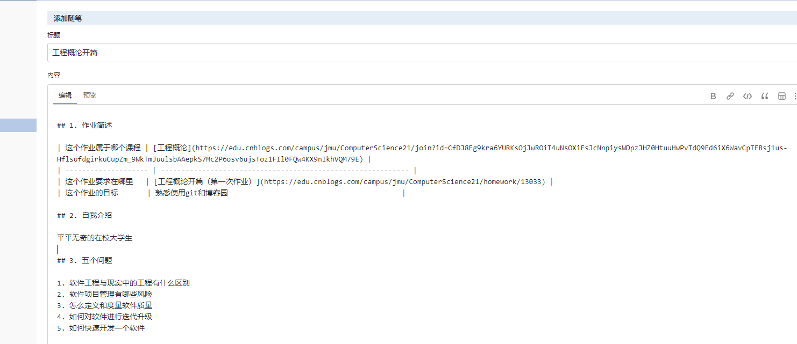
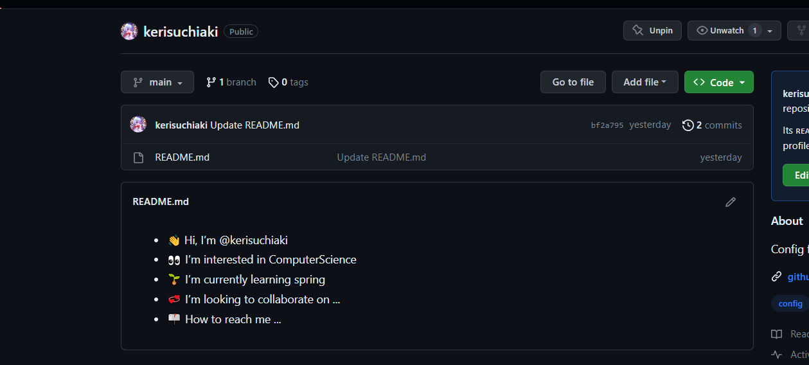

# [工程概论开篇](https://www.cnblogs.com/mindmiles/p/17683467.html)

## 1. 作业简述

| 这个作业属于哪个课程 | [工程概论](https://edu.cnblogs.com/campus/jmu/ComputerScience21/join?id=CfDJ8Eg9kra6YURKsOjJwROiT4uNsOXiFsJcNnpiysWDpzJHZ0HtuuHwPvTdQ9Ed6iX6WavCpTERsj1us-HflsufdgirkuCupZm_9WkTmJuulsbAAepkS7Mc2P6osv6ujsToz1FIl0FQw4KX9nIkhVQM79E) |
| -------------------- | ------------------------------------------------------------ |
| 这个作业要求在哪里   | [工程概论开篇（第一次作业）](https://edu.cnblogs.com/campus/jmu/ComputerScience21/homework/13033) |
| 这个作业的目标       | 熟悉使用git和博客园                                          |

<!--more-->

## 2. 自我介绍

平平无奇的在校大学生

## 3. 五个问题

1. 软件工程与现实中的工程有什么区别
2. 软件项目管理有哪些风险
3. 怎么定义和度量软件质量
4. 如何对软件进行迭代升级
5. 如何快速开发一个软件

## 4. 想要的收获

提升自己的见识，与时俱进,还有快速开发一个软件的能力

## 5. 博客园编辑界面

## github

地址：https://github.com/kerisuchiaki/kerisuchiaki
仓库界面
