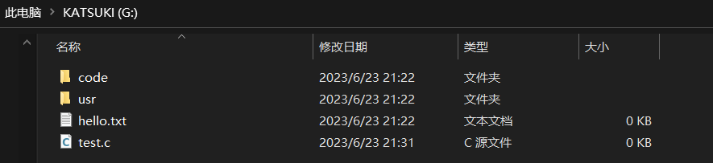

# 1. 基本信息

| 姓名 |    学号     |   班级   | 是否抄袭 | 是否分组 |
| :--: | :---------: | :------: | :------: | :------: |
| yyh  | 2021****117 | 计算2114 |    否    |    否    |

**实现了哪些功能（已实现，并且测试正确的打勾）**

- [x] 打印当前目录下所有文件和目录名，类似于`ls`简易版

- [x] 打印文件/目录的文件控制块

- [x] 打印整个文件分配表

- [x] 切换目录，类似于`cd`功能

- [x] 创建文件、删除文件

- [x] 创建目录、删除文件

- [x] cat命令查看文件(额外实现)

	<!-- more -->

# 2. 功能1 (ls)

## 2.1 实现思路及伪代码

思路：

打印当前目录下的子文件和文件夹，根据fat12文件系统的特点，我们可以访问FCB表，然后再根据FCB表的蔟号，一边到数据区去访问数据一边去fat表查找下一个蔟号，然后继续访问数据区，如果蔟号不为零，继续读取蔟号和数据区直到蔟号为0xfff或其他已分配标识符

伪代码：

```c
读取当前目录的文件控制块，
    读取文件控制块的蔟号，
    根据蔟号访问fat表和数据区，
    while(蔟号不为结束符时){
        继续访问数据区，
            然后访问下一个蔟号；
    }
```


## 2.2 完整的源代码

ls函数代码：

```c
void *ls(const char *dir)
{
    int cnt = 0;
    char dir_name[8];
    strcpy(dir_name, dir);
    if (strlen(dir_name) == 0 || dir_name[0] == '-')
    { // 说明不带参数，打印当前目录下
        fatmp.f[0] = currdir.DIR_FstClus[0];
        fatmp.f[1] = currdir.DIR_FstClus[1];
        int next = read_cluster(fatmp, 0); // 读取当前目录的其实蔟号
        // if(strcmp("AABBCCDD",currdir.DIR_Name)==0){//待解决BUG
        //     //判断是根目录
        //     off=16*8;
        // }
        int index = ((next - 2) * 4 + 64) * 512 + 64;
        if (isroot)
            index = 16512;
        for (int i = index;; i += sizeof ftmp)
        {
            disk_read(&ftmp, i, sizeof ftmp);
            if (ftmp.DIR_Name[0] == (char)0xe5||ftmp.DIR_Name[0] ==0x2e||ftmp.DIR_Name[0] == (char)0xff)
                continue;
            if (ftmp.DIR_Name[0] == 0)
                break;
            char tmp[32];
            for (int j = 0; j < 8 && (ftmp.DIR_Name[j] !=0&&ftmp.DIR_Name[j] !=' '); j++)
            {
                if (dir_name[0] != '-')
                    printf("%c", ftmp.DIR_Name[j]);
                // if (ftmp.DIR_Ext[0] == 0x20)
                // {
                // 是目录,而不是文件夹
                tmp[j] = ftmp.DIR_Name[j];
                if ((j == 7 || ftmp.DIR_Name[j + 1] == 0||ftmp.DIR_Name[j + 1] == ' '))
                    tmp[j + 1] = '\0';
                if (ftmp.DIR_Ext[0] != 0x20 && !(j == 7 || ftmp.DIR_Name[j + 1] == 0||ftmp.DIR_Name[j + 1] == ' '))
                {
                    // 说明是文件，
                    int k = 0;
                    for (k = 0; k < 3 && (ftmp.DIR_Ext[k] != 0&&ftmp.DIR_Ext[k] != ' '); k++)
                    {
                        tmp[j + 1 + k] = ftmp.DIR_Ext[k];
                    };
                    tmp[j + 1 + k] = '\0';
                }
                // }
            };
            if (ftmp.DIR_Ext[0] == 0x20)
            {
                strcpy(res[cnt++], tmp);
            };

            if ((ftmp.DIR_Ext[0] != 0x20&&ftmp.DIR_Ext[0] != 0) && dir_name[0] != '-')
            {
                printf(".");
                for (int j = 0; j < 3; j++)
                    if (dir_name[0] != '-')
                        printf("%c", ftmp.DIR_Ext[j]);
            }
            printf(" ");
        };
        printf("\n");
    };

    // 特殊用处返回当下目录集
    return res;
}
```


## 2.3 测试


# 3.功能2 (打印fat表)

## 3.1实现思路及伪代码

实现思路：

访问fat表，我们首先要知道fat表在哪个扇区，由于保留扇区占8个扇区（包括引导扇区），所以我们很容易知道，fat表从第九个开始，即8号扇区（0开始计数），又因为fat12文件系统的fat表数据采用小段存储并且每个fat表项占12比特而不是计算机的最小操作单元一字节，所以我们需要额外添加功能函数实现转换和读取。

伪代码：

```c
for(int i=fat表起始处；i<fat表结尾处；i+=每两个fat表项大小){
    读取i偏移的两个fat表项，
    调用函数进行转换这个蔟，
    打印到终端
}；
```

## 3.2完整的源代码

```c

//打印文件分配表
void print_fat(){
    int index=4096;
    for(int i=index;i<10240;i+=(sizeof fatmp)){
    disk_read(&fatmp,i,sizeof fatmp);
    int left=read_cluster(fatmp,0);
    int right=read_cluster(fatmp,1);
    if(left!=0)
    printf("index=%d 左边蔟%d \n",(i-4096)/3*2,left);
    if(right!=0)
    printf("index=%d 右边蔟%d \n",(i-4096)/3*2+1,right);
}
};
int read_cluster(struct fat f,int flag){
    int ans=0;
    if(flag==0){//读取左边的蔟
        f.f[1]<<=4;
        ans=f.f[1];
        ans<<=4;
        ans+=f.f[0];
    }
    else {//读取右边的蔟
        ans=f.f[2];
        ans<<=4;
        f.f[1]>>=4;
        ans+=f.f[1];
    };
    return ans;
}

```

## 3.3测试

winhex上查看u盘的扇区信息，图中从4096开始的就是fat表：


我们在实现的fat12文件系统上输入fat命令即可打印fat表，并且是经过转换的的十进制：


# 4. 功能3（打印文件分配表）

## 4.1实现思路及伪代码

思路：

经过计算我们很容易得知根目录的起始扇区，然后我们就可以打印根目录的文件分配表，每32个字节的读取（文件分配表的大小），

然后输出子目录和文件的文件名包括拓展名，起始蔟号，大小等等。

伪代码：

```c
for(int i=根目录起始处；i<根目录结束处；i+=sizeof FCB){
    if(该文件分配表的开始字节不为未分配结束符)
        print(文件分配表的名字，文件分配表的拓展名等等)；
    if（该文件分配表的开始字节为结束标识符）break;
}
```

## 4.2完整的源代码

```c

//打印FCB
void print_fcb(){
    int index=16384;
    for(int i=index;i<23552;i+=(sizeof fcb)){//扫描224个子目录
    disk_read(&ftmp,i,sizeof ftmp);
    if(ftmp.DIR_Name[0]==0)break;
    if(ftmp.DIR_Name[0]!=(char)0xe5){
        if(ftmp.DIR_Name[0]=='A'||ftmp.DIR_Name[0]==0x01){
            //说明是长文件名或这带空格
            char name[32];
            disk_read(&name,i,sizeof ftmp);
            printf("大概文件名：");
            for(int i=1;i<32;i++){
                printf("%c",name[i]);
            };
            printf("\n");
        }
        else if(ftmp.DIR_Name[0]!=(char)0xFF){
            //说明是上次的长文件名
            printf("文件名: ");
            for(int j=0;j<8&&ftmp.DIR_Name[j]!=' ';j++){
                printf("%c",ftmp.DIR_Name[j]);
            };
            if(ftmp.DIR_Ext[0]!=' '){
                printf(".");
              for(int j=0;j<3&&ftmp.DIR_Name[j]!=' ';j++){
                printf("%c",ftmp.DIR_Ext[j]);
            };  
            };
            printf("\n");
            printf("数据起始蔟号: %u\n",ftmp.DIR_FstClus);
            printf("文件大小: %u\n",ftmp.DIR_FileSize);
            printf("\n");
        }
    }
    }
}
```

## 4.3测试

根目录文件夹和文件：



打印根目录fcb表；


# 5.功能5（cd）

## 5.1实现思路及伪代码

思路：

我们用一个fcb结构体记录当前目录，当进入子目录时，访问当前目录的fcb表的蔟号，到数据去查找并访问子目录即可

伪代码：

```c
访问当前目录的fcb，
    访问fat表，
    访问子目录的数据区，
    if（存在子目录）进入子目录
    else 报错
```

## 5.2完整源码

```c

void cd(const char *dir)
{
    char dir_name[32];
    strcpy(dir_name, dir);
    if (dir_name[0] != '.' || dir_name[1] != '.')
    {
            int clus;
                if (isroot)
                {
                    // 根目录特殊处理
                    for (int j = 16384;; j += sizeof fcb)
                    {
                        disk_read(&ftmp, j, sizeof ftmp);
                        int j = 0;
                        for (j = 0; ftmp.DIR_Name[j] != ' ' && j < 8; j++)
                        {
                        };
                        ftmp.DIR_Name[j] = '\0';
                        if (strcmp(ftmp.DIR_Name, dir_name) == 0)
                        {
                            // 找到
                            fatmp.f[0] = currdir.DIR_FstClus[0];
                            fatmp.f[1] = currdir.DIR_FstClus[1];
                            int clus = read_cluster(fatmp, 0);
                            int index = ((clus - 2) * 4 + 64) * 512;
                            for (int k = 0;; k++)
                            {
                                if (lastdir[k] == -1)
                                {
                                    if (!isroot)
                                        lastdir[k] = index;
                                    else
                                    {
                                        lastdir[k] = 16384;
                                    }
                                    break;
                                }
                            }
                            currdir = ftmp;
                            strcat(currdir_str, "/");
                            strcat(currdir_str, dir_name);
                            isroot = 0;
                            return;
                        }
                    };
                    printf("当前根目录没有此目录\n");
                    return;
                }
                else
                {
                    // 不是根目录，去数据去寻找
                    fatmp.f[0] = currdir.DIR_FstClus[0];
                    fatmp.f[1] = currdir.DIR_FstClus[1];
                    clus = read_cluster(fatmp, 0);
                    int index = ((clus - 2) * 4 + 64) * 512;
                    for (int j = index;; j += sizeof ftmp)
                    {
                        disk_read(&ftmp, j, sizeof ftmp);
                        int j = 0;
                        for (j = 0; j < 8 && (ftmp.DIR_Name[j] != ' '&&ftmp.DIR_Name[j] != 0); j++)
                            ;
                        ftmp.DIR_Name[j] = '\0';
                        if (strcmp(ftmp.DIR_Name, dir_name) == 0)
                        {
                            // 找到目标文件夹FCB;
                            currdir = ftmp;
                            for (int k = 0;; k++)
                            {
                                if (lastdir[k] == -1)
                                {
                                    if (!isroot)
                                        lastdir[k] = index;
                                    else
                                    {
                                        lastdir[k] = 16384;
                                    }
                                    break;
                                }
                            }
                            isroot = 0;

                            /*
                            在当前目录新加
                            */
                            strcat(currdir_str, "/");
                            strcat(currdir_str, dir_name);
                            return;
                        }
                    }
                };
        printf("当前目录下没有此目录\n");
        return;
    }
    else if (dir_name[0] != '/')
    {
        // 退回上级目录
        int cnt = 0;
        for (int i = 0; dir_name[i] != '\0' && i < 8; i++)
        {
            if (dir_name[i] == '.')
                cnt++;
            ;
        };
        cnt = -1;
        if (cnt == 0)
        {
            printf("输入参数有误\n");
            return;
        };
        /*
         */
        for (int i = 0;; i++)
        {
            if (lastdir[i] == -1)
            {
                disk_read(&ftmp, lastdir[i - 1], sizeof ftmp);
                currdir = ftmp;
                lastdir[i - 1] = -1;
                int len = strlen(currdir_str);
                while (len--)
                {
                    if (currdir_str[len] == '/')
                    {
                        currdir_str[len] = '\0';
                        break;
                    }
                }
                return;
            }
        }
        cd(currdir_str);
    }
    
}
```

## 5.3测试

一个子目录：


使用cd进入：


# 5.功能4（删除和创建文件）

## 5.1思路及伪代码

思路：创建时先访问当前目录的fcb表，找到数据区，查看数据区是否还有空闲剩余空间，有则将要创建的文件写入，并在fat表查找未使用蔟，然后分配蔟号，同理删除时最后只是将文件按控制块和对应的蔟标记为未使用，

伪代码：

```c
创建：
    访问当前目录的数据区，
    if（数据区还有剩余空间）{
    访问fat表；
        if（fat表还有未分配蔟）
        分配蔟分配空间记录在数据区中
}
删除：
     访问当前目录的数据区，
    if（找到文件）{
    访问fat表；
        将fat表和FCB标记为未使用；
}
```

## 5.2完整源代码

```c

void touch(const char *dir)
{
    char *st;
    st=strstr(dir,".");
    if(st==NULL){
        printf("没有文件后缀\n");
        return;
    };
    int len=strlen(st+1);
    if(len>3){
        printf("后缀过长,请重新输入\n");
        return;
    };
    
    struct FCB new_dir;
    strcpy(new_dir.DIR_Ext,st+1);
    (*st)='\0';
    len=strlen(dir);
    if(len>8){
        printf("文件名过长,请重新输入");
        return;
    };
    int pt=0;
    for(pt=0;new_dir.DIR_Ext[pt]!='\0'&&pt<3;pt++);
    if(pt<3){
        for(int i=pt;i<3;i++)
    new_dir.DIR_Ext[i]=' ';
    }
    strcpy(new_dir.DIR_Name, dir); // 我是傻逼，当然要用strcmp函数复制
    for(pt=0;new_dir.DIR_Name[pt]!='\0'&&pt<8;pt++);
    if(pt<8){
    for(int i=pt;i<8;i++)
    new_dir.DIR_Name[i]=0;
    }
    new_dir.DIR_Attr = 0x20;
    time_t t;     // 将t声明为时间变量
    struct tm *p; // struct tm是一个结构体，声明一个结构体指针
    time(&t);
    p = localtime(&t); // 获得当地的时间
    // printf("%d-%d-%d %d:%d:%d",1900+p->tm_year,1+p->tm_mon,p->tm_mday,p->tm_hour,p->tm_min,p->tm_sec);
    new_dir.DIR_CreateDate = 1900 + p->tm_year;
    new_dir.DIR_LastDate = 1900 + p->tm_year;
    fatmp.f[0] = currdir.DIR_FstClus[0];
    fatmp.f[1] = currdir.DIR_FstClus[1];
    int clus = read_cluster(fatmp, 0);
    int index = ((clus - 2) * 4 + 64) * 512;
    if (isroot)
        index = 16384;
    for (int i = index; i < index + 4 * 512; i += sizeof ftmp)
    {
        disk_read(&ftmp, i, sizeof ftmp);
        if (ftmp.DIR_Name[0] == (char)0xe5 || ftmp.DIR_Name[0] == (char)0xff || ftmp.DIR_Name[0] == 0)
        {
            for (int i = 4096 + 3; i < 4096 + 12 * 512; i += (sizeof fatmp))
            {
                disk_read(&fatmp, i, sizeof fatmp);
                int next_clus = read_cluster(fatmp, 0);
                if (next_clus != 0)
                {
                    // 左边使用蔟
                    next_clus = read_cluster(fatmp, 1);
                    if (next_clus != 0)
                    {
                        // 右边已使用蔟
                        continue;
                    }
                    else if (next_clus == 0)
                    {
                        // 右边未使用蔟
                        write_cluster(&fatmp, 1, 0xfff);
                        next_clus = (i - 4096) / 3 * 2 + 1;
                    };
                }
                else if (next_clus == 0)
                {
                    // 左边未使用
                    write_cluster(&fatmp, 0, 0xfff);
                    next_clus = (i - 4096) / 3 * 2;
                };
                struct fat_one fot;
                write_cluster_end(&fot, next_clus);
                new_dir.DIR_FstClus[0] = fot.f[0];
                new_dir.DIR_FstClus[1] = fot.f[1];
                disk_write(&fatmp, i, sizeof fatmp);
                break;
            };
            disk_write(&new_dir, i, sizeof ftmp);
            printf("创建成功\n");
            return;
        };
    }
    printf("当前目录下没有足够空间分配\n");
    return;
}
void rm(const char *dir)
{

    char dir_name[32];
    char dir_ext[32];
    strcpy(dir_name, dir);
    int isfile=0;
    char *st=NULL;
    st=strstr(dir,".");
    if(st!=NULL){
        //确认是文件
        isfile=1;
        strcpy(dir_ext,st+1);
        st=strstr(dir_name,".");
        (*st)='\0';
    };
    if (strcmp(dir_name, "") != 0)
    {
        int clus;
        // 不是根目录，去数据去寻找
        fatmp.f[0] = currdir.DIR_FstClus[0];
        fatmp.f[1] = currdir.DIR_FstClus[1];
        clus = read_cluster(fatmp, 0);
        int index = ((clus - 2) * 4 + 64) * 512;
        if (isroot)
            index = 16384; // 根目录特殊处理
        for (int j = index;; j += sizeof ftmp)
        {
            if(j==39360){
                printf("");
            }
            disk_read(&ftmp, j, sizeof ftmp);
            int k = 0;
            if (ftmp.DIR_Name[0] == 0)
                break; // 找完了，没找到，
            for (k = 0; k < 8 && ftmp.DIR_Name[k] != 0; k++)
                ;
            if(k<7)ftmp.DIR_Name[k] = '\0';
            for(int g=0;g<8;g++){
                if(ftmp.DIR_Name[g]==' ')ftmp.DIR_Name[g]=0;
            };
            if (strcmp(ftmp.DIR_Name, dir_name) == 0)
            {   
                if(
                    ((ftmp.DIR_Ext[0]==0||ftmp.DIR_Ext[0]==' ')&&isfile==1)||
                (ftmp.DIR_Ext[0]!=0&&isfile==0)
                )
                {
                    //只是文件夹和文件名字重复
                    continue;
                };
                if(isfile){
                    char fcb_ext[32];
            for (k = 0; k < 3&& (ftmp.DIR_Ext[k] != 0&&ftmp.DIR_Ext[k] != ' '); k++);
            ftmp.DIR_Ext[k] = '\0';
                    strcpy(fcb_ext,ftmp.DIR_Ext);
                    if(strcmp(fcb_ext,dir_ext)!=0){
                        //文件拓展名不匹配
                        continue;
                    }
                }
                // 找到目标文件FCB;

                fatmp.f[0] = ftmp.DIR_FstClus[0];
                fatmp.f[1] = ftmp.DIR_FstClus[1];
                int clus = read_cluster(fatmp, 0);
                int index = clus / 2 * 3 + 4096;
                disk_read(&fatmp, index, sizeof fatmp);
                if (clus % 2 == 0)
                {
                    write_cluster(&fatmp, 0, 0);
                }
                else
                {
                    write_cluster(&fatmp, 1, 0);
                };
                disk_write(&fatmp, index, sizeof fatmp); // 更新fat表
                memset(&ftmp, 0XFF, sizeof ftmp);
                disk_write(&ftmp, j, sizeof ftmp); // 更新数据区
                return;
            }
        };
        printf("当前目录下没有此文件或目录\n");
        return;
    }
    printf("参数有误\n");
    return;
}
```

## 5.3测试

touch:


rm:


# 6.功能5（创建文件夹和删除）

## 6.1思路和伪代码

思路：

和上一个创建删除文件的思路类似，因为目录也是一种特殊的文件

伪代码：

```c
创建：
    访问当前目录的数据区，
    if（数据区还有剩余空间）{
    访问fat表；
        if（fat表还有未分配蔟）
        分配蔟分配空间记录在数据区中
}
删除：
     访问当前目录的数据区，
    if（找到文件）{
    访问fat表；
        将fat表和FCB标记为未使用；
}
```

## 6.2源代码

```c

void mkdir(const char *dir)
{
    struct FCB new_dir;
    strcpy(new_dir.DIR_Name, dir); // 我是傻逼，当然要用strcmp函数复制
    strcpy(new_dir.DIR_Ext,"");
    for(int i=0;i<3;i++)new_dir.DIR_Ext[i]=0;
    new_dir.DIR_FileSize = 0;
    new_dir.DIR_Attr = 0x10;
    fatmp.f[0] = currdir.DIR_FstClus[0];
    fatmp.f[1] = currdir.DIR_FstClus[1];
    int clus = read_cluster(fatmp, 0);
    int index = ((clus - 2) * 4 + 64) * 512;
    if (isroot)
        index = 16384;
    for (int i = index; i < index + 4 * 512; i += sizeof ftmp)
    {
        disk_read(&ftmp, i, sizeof ftmp);
        if (ftmp.DIR_Name[0] == (char)0xe5 || ftmp.DIR_Name[0] == (char)0xff || ftmp.DIR_Name[0] == 0)
        {
            for (int i = 4096 + 3; i < 4096 + 12 * 512; i += (sizeof fatmp))
            {
                disk_read(&fatmp, i, sizeof fatmp);
                int next_clus = read_cluster(fatmp, 0);
                if (next_clus != 0)
                {
                    // 左边使用蔟
                    next_clus = read_cluster(fatmp, 1);
                    if (next_clus != 0)
                    {
                        // 右边已使用蔟
                        continue;
                    }
                    else if (next_clus == 0)
                    {
                        // 右边未使用蔟
                        write_cluster(&fatmp, 1, 0xfff);
                        next_clus = (i - 4096) / 3 * 2 + 1;
                    };
                }
                else if (next_clus == 0)
                {
                    // 左边未使用
                    write_cluster(&fatmp, 0, 0xfff);
                    next_clus = (i - 4096) / 3 * 2;
                };
                struct fat_one fot;
                write_cluster_end(&fot, next_clus);
                new_dir.DIR_FstClus[0] = fot.f[0];
                new_dir.DIR_FstClus[1] = fot.f[1];
                disk_write(&fatmp, i, sizeof fatmp);
                break;
            };
            disk_write(&new_dir, i, sizeof ftmp);
            printf("创建成功\n");
            return;
        };
    }
    printf("当前目录下没有足够空间分配\n");
    return;
}
```

## 6.3测试

mkdir功能：


# 7.功能6（实现cat）

## 7.1思路及伪代码

思路：

和访问文件控制块类似，最后只要再访问FCB的数据区读取数据即可

## 7.2源代码

```c

void cat(const char *dir){
    char dir_name[32];
    char dir_ext[32];
    char *st;
    st=strstr(dir,".");
    if(st==NULL){
        printf("没有后缀，不是文件,请重新输入\n");
        return ;
    };
    strcpy(dir_ext,st+1);
    (*st)='\0';
    strcpy(dir_name, dir);
    // int len=strlen(dir);
    // if(len<7)dir_name[len]=' ';
    if (dir_name[0] != '.' || dir_name[1] != '.')
    {
        // 进入当前目录子目录
        //  char **dirset=NULL;
            int clus;
                // 找到目标目录
                if (isroot)
                {
                    // 根目录特殊处理
                    for (int j = 16384;; j += sizeof fcb)
                    {
                        disk_read(&ftmp, j, sizeof ftmp);
                        int k = 0;
                        for (k = 0; (ftmp.DIR_Name[k] != ' '&&ftmp.DIR_Name[k] != 0) && k < 8; k++)
                        {
                        };
                        ftmp.DIR_Name[k] = '\0';
                        char ext[32];
                        for(int h=0;h<3;h++){
                            if(ftmp.DIR_Ext[h]==' '||ftmp.DIR_Ext[h]==0){
                            ext[h]='\0';    
                                break;
                            }
                            ext[h]=ftmp.DIR_Ext[h];
                        };
                        if (strcmp(ftmp.DIR_Name, dir_name) == 0&&strcmp(ext,dir_ext)==0)
                        {
                            // 找到
                            fatmp.f[0] = ftmp.DIR_FstClus[0];
                            fatmp.f[1] = ftmp.DIR_FstClus[1];
                            int clus = read_cluster(fatmp, 0);
                            int index = ((clus - 2) * 4 + 64) * 512;
                            for(int l=index;;l++){
                                    char chr;
                                    disk_read(&chr,l,sizeof chr);
                                    if(chr==0){
                                        printf("\n");
                                        return ;
                                    }
                                    printf("%c",chr);
                            }
                            return;
                        }
                    };
                    printf("当前根目录没有此文件\n");
                    return;
                }
                else
                {
                    // 不是根目录，去数据去寻找
                    fatmp.f[0] = currdir.DIR_FstClus[0];
                    fatmp.f[1] = currdir.DIR_FstClus[1];
                    clus = read_cluster(fatmp, 0);
                    int index = ((clus - 2) * 4 + 64) * 512;
                    for (int j = index;; j += sizeof ftmp)
                    {
                        disk_read(&ftmp, j, sizeof ftmp);
                        int k = 0;
                        for (k = 0; k < 8 && ftmp.DIR_Name[k] != ' '; k++);
                        ftmp.DIR_Name[k] = '\0';
                        if (strcmp(ftmp.DIR_Name, dir_name) == 0)
                        {
                            fatmp.f[0] = ftmp.DIR_FstClus[0];
                            fatmp.f[1] = ftmp.DIR_FstClus[1];
                            int clus = read_cluster(fatmp, 0);
                             index = ((clus - 2) * 4 + 64) * 512;
                            // 找到目标文件FCB;
                            for(int l=index;;l++){
                                    char chr;
                                    disk_read(&chr,l,sizeof chr);
                                    if(chr==0){
                                        printf("\n");
                                        return ;
                                    }
                                    printf("%c",chr);
                            }
                        }
                    }
                };
        printf("当前目录下没有此文件\n");
        return;
    }
}
```

## 7.3测试

cat main.c


