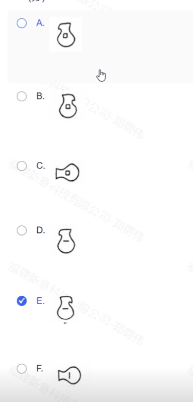

# 逻辑测评

## 1.B

<!-- more -->


## 2.E

## 3.G

G

## 4.C

C

## 5.B

B

## 6.E

E

## 7.D

第一组：8 (上) 和 7 (下)，3左 和 10右。

28 30 33 36

第二组：9 (上) 和 9 (下)，6左 和 6右。

第三组：4 (上) 和 16 (下)，8左 和 5右。

第三组：15 (上) 和 15 (下)，左6 和 右?。

问号处应填入一下哪个7，8，9，10，11


## 8.F

F

## 9.D


## 10.


## 11.B

B

## 12.C


## 13.D


## 14.D

D

## 15.E


## 16.B

B

## 17.G


## 18.E

E

## 19.16

# java部分

## 1A .关于集合框架，说法不正确的是 (4分)
A集合框架中的List,Set,Map接口都是Collection接口的子接口
B.List接口是可以包含重复元素的有序集合
C集合框架不能保存基本类型
DHashMap将键映射到值，键不可以重复但可以为NULL。

## 2.A下面的排序算法中，初始数据集的排列顺序对算法的性能无影响的是 (4分)
A.堆排序
B.插入排序
C.冒泡排序
D.快速排序

## 3.C下面说法正确的是 (4分)
A.class中的constructor不可省略
B.constructor必须与class同名，但方法不能与class同名
C.constructor在一个对象被new时执行
D.假如一个类缺少没有参数的构造方法，但是有其它的构造方法，则编译器生成一个缺省的构造方法

## 4.C关于static成员和对象成员的说法正确的是 (4分)
A.static成员变量在对象构造时生成
B.static成员函数在对象成员函数中无法调用
C所在类的对象共享其静态成员变量的值
D.static成员函数不能访问static成员变量

## 5.B.下列描述正确的是_ (4分)
A抽象类自身可以定义成员而接口不可以。
B.类实现了接口，实现接口中的方法时可以重写该方法的访问权限，但是无法改变接口中变量的值。
C类必须显示定义构造函数，类可以定义多个构造函数。
D.抽象方法可以没有方法体，也可以有方法体。

## 6.A DELETE FROM EMP WHERE HIRE_DATE>20220701;语句的功能是(4分)
A.从EMP表中彻底删除入司日期(HIRE_DATE)大于20220701的记录
B.EMP表中入司日期(HIRE_DATE)大于20220701的记录被加上删除标记
C.将EMP表中入司日期(HIRE_DATE)为20220701的列值为空
D.删除EMP表的入司日期(HIRE_DATE)

## 7.D下面有关JAVA异常类的描述错误的是(4分)
A.finally语句块是不管有没有出现异常都要执行的内容。
B.非RuntimeException一般是程序错误(或缺陷)，其必须被try-catch语句块所捕获
C.Error类体系描述了Java运行系统中的内部错误以及资源耗尽的情形，Error不需要捕捉
D.RuntimeException包括错误的类型转换、数组越界访问和试图访问空指针等等，必须被try-catch语句块捕获


## 8.D假设web应用的文档根目录为MyApp，那么可以从哪里找到datebase.jar文件(4分)
A.MyApp目录下
B.MyAppIWEB-INF目录下
C.MyAppIWEB-INFlibs目录下
D.MyAppIWEB-INF\lib目录下

## 9.C下列关于视图的说法中正确的是 (4分)
A．对视图的使用与表一样，也可以进行插、查、删、改操作
B．视图与表一样，也存储着数据
C．对视图的操作，是最终都要转化成对基本表的操作
D．视图的数据一般是物理存储的

## 10.A以下对继承的描述错误的是 (4分)
A.在Java中允许定义一个父类的引用，指向子类对象
B.接口中的成员变量和成员方法只能是Public (或者缺省不写)
C在Java中一个子类可以继承多个抽象类，在extends关键字后一次列出，用逗号隔开
D.当实例化子类时会递归调用父类中的构造方法

## 简答题

1.作用域public,private,protected,以及不写时的区别？(5分)


2.问：下面的代码输出是？


```java
public class Parent{
    public void method(){
        System.out.prrintln("parent");
    }
    public static void smethod(){
        System.out.println("parent");
    }
};
public class Child extends Parent{
    public void method(){
        System.out.println("child");
    }
    public void smethod(){
        System.out.println("child");
    }
};
public class Test{
    public static void print(String[] args){
        Child c=new Child();
        Parent p=(Parent)c;
        p.method();
        p.smethod();
    }
}
// 输出结果
// child
// parent
```

解释，实例方法跟实例有关，而静态方法只跟类有关，为什么静态方法只跟声明的类有关而取决于实例的类，这是因为静态方法在编译时就已经确定，编译器知道你要调用静态方法，不会关心这个静态方法的类的实例对象，这也就是为什么调用静态方法尽量使用类名而不是对象，当使用对象调用静态方法时可能被其它方法优化掉（其实就是编译器编译时被替换成了类名调用）


3.如何判断一个字符串是否为数字。

```c++
```


4.


(CSS）看下列代码，<p>标签内的文字是什么颜色的？为什么?

```c++
看下列代码，<p>标签内的文字是什么颜色的？为什么?
<html>
<style>
    .classA {
        color: blue;
    }

    .classB {
        color: red;
    }
</style>

<body>
    <p class='classB classA'>123</p>
</body>

</html>
```

答案是红色


在HTML和CSS中，当一个元素被赋予多个类名时，CSS样式的优先级是由CSS选择器的特异性（specificity）决定的。特异性高的样式规则会覆盖特异性低的规则。如果多个规则具有相同的特异性，则最后定义的规则将被应用。

在你提供的代码中，`<p>` 标签被赋予了两个类名：`classB` 和 `classA`。由于这两个类名的特异性相同（它们都是类选择器，并且没有其他选择器、ID选择器或内联样式增加特异性），因此最后定义的规则将被应用。


5.\

```js
var f=true;
if(f===true){
var a=10;
}
function fn(){
var b=20;
C=30;
}
fn();
console.log(a);
console.log(c);
```


6.

7.

8.

9.

# 前端部分

## 选择题

1.

## 编程算法题

1.找出一个序列中不重复的数字


# 测试部分

1-2.

3-4.

5.

## 第二部分

1-2.

3.逻辑推理

4.

5.

# 技术支持

1.

```c++
public class Main {
    public static String[] solve(String s[]){
        int n = s.length - 1;
        for (int i = 0; i <= n / 2; i++) {
            String t=s[i];
            s[i]=s[n-i];
            s[n-i]=t;
        };
        return s;
    };

    public static void main(String[] args) {
        String s[]={
                "i","am","a","student"
        };
        solve(s);
        for(String str:s)System.out.print(str+" ");
    }
}

```

```c++
#include <bits/stdc++.h>
using namespace std;
string solve(string s)
{
    vector<string> arr;
    string str;
    for (int i = 0; i < s.size(); i++)
    {
        if (s[i] == ' ')
        {
            arr.push_back(str);
            str="";
            continue;
        };
        str += s[i];
    };
    arr.push_back(str);
    int n = arr.size() - 1;
    string ans = "";
    for (int i = 0; i <= n / 2; i++)
    {
        string t = arr[n - i];
        arr[n - i] = arr[i];
        arr[i] = t;
    };
    for(string t:arr){ans+=t;ans+=" ";};
    return ans;
};
int main()
{
    //   Main* s=  new Main();
    string str = "i am a student";
    //   cout<<s->solve(str);
    cout << solve(str);
    return 0;
}
```


2.


在 Oracle 数据库中，假设你要查询 `DEPT` 表中 `LOC` 为 `'NEWYORK'` 的所有雇员的名字，可以通过以下三种不同的方式来实现：

### 1. **使用 `JOIN`（显式连接）**:
通过 `INNER JOIN` 来连接 `EMP` 和 `DEPT` 表，基于 `DEPTNO` 字段匹配，筛选出 `DEPT.LOC = 'NEWYORK'` 的雇员。

```sql
SELECT e.ENAME
FROM EMP e
JOIN DEPT d ON e.DEPTNO = d.DEPTNO
WHERE d.LOC = 'NEWYORK';
```

### 2. **使用 `WHERE` 子句进行连接（隐式连接）**:
这是另一种常见的写法，使用 `WHERE` 子句来实现表的连接，效果和 `JOIN` 一样。

```sql
SELECT e.ENAME
FROM EMP e, DEPT d
WHERE e.DEPTNO = d.DEPTNO
  AND d.LOC = 'NEWYORK';
```

### 3. **使用子查询**:
通过子查询，首先查找 `DEPT` 表中 `LOC = 'NEWYORK'` 的部门，然后查找这些部门的所有雇员。

```sql
SELECT ENAME
FROM EMP
WHERE DEPTNO IN (SELECT DEPTNO FROM DEPT WHERE LOC = 'NEWYORK');
```

### 说明：
- **方法 1（`JOIN`）**：显式连接使用 `JOIN` 语句，通过 `ON` 条件明确表之间的关系，这种方式在 SQL 中比较清晰且容易理解。
- **方法 2（隐式连接）**：通过 `WHERE` 子句连接表，虽然这种写法在 SQL 中也很常见，但现代 SQL 更推荐显式连接，因为它更易于阅读。
- **方法 3（子查询）**：通过子查询查询 `DEPT` 表的 `DEPTNO` 值，然后在外部查询中使用这些部门代码查找对应的雇员。

这三种方法都能达到相同的结果，可以根据不同的场景或个人习惯选择使用哪一种。


3.

根据沟通原则的要求，改善这些句子时需要做到以下几点：

- **对事不对人**：强调问题或行为，而不是个人。
- **避免下命令**：用委婉和协商的方式表达。
- **负责起责任**：不推卸责任，表达出主动和承担的态度。
- **避免指责客户**：采取更为温和、建设性的方式沟通。

### 1. **对事不对人：“你没有填对”**
   **这样说更好**：  
   “这部分信息好像没有填对，您能再检查一下吗？”

   **解释**：  
   这样的表达避免了直接指责对方，聚焦在问题上，并且使用了更为礼貌和合作的语气。

### 2. **我代替你：“你把我搞糊涂了”**
   **这样说更好**：  
   “我对这个部分有点困惑，能否再解释一下？”

   **解释**：  
   这样说既避免了指责，也表现出自己对理解问题的开放态度，并请求对方澄清。

### 3. **避免下命令：“你必须”**
   **这样说更好**：  
   “为了更好地完成任务，我们可以尝试这样做。”

   **解释**：  
   这样的表达更加委婉，给对方更多的选择和理解的空间，同时还是表明了自己的建议。

### 4. **负责起责任：“这不是我的事”**
   **这样说更好**：  
   “虽然这部分不完全是我的责任，但我愿意帮助解决问题。”

   **解释**：  
   这种表达避免推卸责任，并且展现了主动帮助和合作的态度。

### 5. **避免指责客户：“你总是不及时付款”**
   **这样说更好**：  
   “我们注意到付款有时会有所延迟，能否请您协助我们确认付款时间？”

   **解释**：  
   这种表达更加温和，避免了指责，而是提出了问题并请求客户协助解决。

这些改进的表达方式遵循了**尊重、合作和积极沟通**的原则，使沟通更加有效且维护了良好的关系。

4.


## 4

#### **问题分析：**

该工程师的行为是不正确的，具体原因如下：

1. **情绪化回应：** 工程师因投诉而情绪化，打电话给客户埋怨客户没有弄清楚事实并责怪客户向领导投诉，这种行为不专业且不符合客户服务的基本规范。情绪化反应可能让客户感到不被尊重，从而加剧了客户的不满。
2. **没有有效沟通：** 工程师在处理客户投诉时，没有采取有效的沟通方式。客户投诉的问题已经解决，但工程师应该主动与客户沟通，并通过专业的态度确认客户的需求和情况，而不是通过责备客户来表达自己的情绪。
3. **缺乏客户意识：** 工程师对客户提出的问题反应过激，表明缺乏良好的客户服务意识。在服务过程中，不论客户是否对事实完全了解，服务人员都应当以积极、建设性的态度回应，帮助客户理解并解决问题。
4. **失礼的语言：** 最后，工程师在电话中说“以后你们有什么事情不要来找我”，这是一种不负责任且失礼的言辞。作为一个服务人员，应该以开放、友善和合作的态度面对客户，而不是通过排斥的言语表达不满。

#### **分析该工程师的错误之处：**

1. **情绪控制不当**： 工程师未能保持冷静，情绪过度反应。客户的投诉无论是否完全准确，工程师应该保持专业和冷静，通过沟通来化解误解，而不是用责备的态度回应客户。
2. **没有站在客户角度思考问题**： 客户的投诉表明他对问题处理的进展有疑问，而不是纯粹为了找麻烦。工程师未能从客户的角度考虑，客户对事件的认知差异可能是因为沟通不畅，而不是客户故意捏造事实。
3. **缺乏团队合作精神**： 工程师的言辞表明，他不愿意承担与客户沟通和解决问题的责任，甚至在面对投诉时表现出拒绝合作的态度。这种态度对团队合作和客户关系都会产生负面影响。

#### **如何对该工程师做思想工作：**

1. **帮助其意识到情绪管理的重要性**： 强调在任何工作中，尤其是涉及客户服务时，情绪控制的重要性。客户是公司最重要的资源，工程师应该始终以冷静、理性和专业的态度处理问题，不管问题的大小和客户的态度。
2. **加强沟通技巧培训**： 向工程师强调良好的沟通技巧，并指导其如何处理客户的不满。可以通过角色扮演、培训等方式提高其与客户沟通时的柔性与技巧，避免过于直接和激烈的反应。
3. **树立团队合作精神**： 提醒工程师，客户投诉不仅仅是个人责任，更是团队责任。解决问题时，团队成员需要相互支持和协作。任何一个环节的沟通不畅，都会导致客户不满，因此要与团队保持紧密的合作与配合。
4. **明确职业道德和责任**： 强调作为工程师，不仅要具备专业技术能力，还要具备良好的职业道德和责任心。在客户有问题时，应该主动处理，而不是逃避或责怪客户。

#### **如何向客户做好解释工作，圆满解决该投诉事件：**

1. **首先向客户表达理解和歉意**： 无论客户投诉的内容是否完全准确，首先应该向客户表达理解，并表示公司对此事的重视。例如：“感谢您及时反馈问题，抱歉给您带来了不便。我们理解您对问题处理进度的关注。”
2. **澄清事实并提供解决方案**： 向客户解释该问题已经得到解决，并且公司已采取必要措施确保类似问题不会再次发生。可以提供一些具体的解决步骤或改进措施，以增强客户的信任。例如：“经过调查，我们发现该问题已经得到及时处理。为确保您的需求得到更好的服务，我们已经加强了对类似问题的跟进。”
3. **保持专业和友善的沟通**： 在与客户沟通时，保持友善、耐心的态度。可以表示愿意继续为客户提供服务，建立长期的合作关系：“如果您有任何问题或需要进一步的帮助，随时欢迎与我们联系，我们将竭诚为您服务。”
4. **进一步提升服务质量**： 表达公司会以此事件为契机，进一步提升服务质量，确保客户的需求能够更及时地得到响应。例如：“我们将根据您的反馈，改进我们的沟通流程，确保以后能更快速地解决类似问题。”

### 结论：

该工程师的行为明显不符合专业服务标准，需要通过思想工作帮助其改进情绪管理和沟通技巧。同时，向客户的解释工作应尽量保持专业、理解和建设性，以平息客户的不满，恢复客户对公司的信任，并为今后的服务质量提供保障。

## 5

面对葛朗台给你推荐的这个困境，你需要运用综合的思维方式解决这个问题。考虑到写字楼中电梯数量有限，且职员对上下班时的拥挤现象感到不满，你需要通过合理的优化和创新的解决方案来平衡各方利益，既要尽量缓解电梯拥挤的问题，又要避免额外建设新电梯或大规模改变现有设施。以下是你可以考虑的步骤：

### 1. **评估当前问题的根本原因**

首先，你需要了解电梯拥挤的具体情况，包括：

- 每天高峰时段的电梯使用情况，例如上下班时间的高峰期。
- 每部电梯的运载能力和乘客流量。
- 各家公司职员的上下班时间是否有重叠或集中。

通过对这些因素的详细分析，可以找出哪些因素导致电梯拥挤，进而决定最有效的解决方案。

### 2. **考虑调整上下班时间**

一种较为简单且成本较低的解决方案是通过调整各公司职员的上下班时间，避免高峰期过于集中。你可以提出以下建议：

- 与各家公司协商，合理安排不同公司职员的上班时间和下班时间。
- 比如，某些公司可以提前10至15分钟上班，另一些公司则可以推后5至10分钟，这样可以有效分散高峰期的客流，避免所有职员集中在同一时段乘坐电梯。
- 此外，还可以考虑鼓励某些公司采用弹性工作制，让员工在更灵活的时间段上下班，减少电梯的压力。

### 3. **优化电梯调度和管理**

电梯的调度和管理方式也可以通过智能化手段进行优化，来提升电梯的使用效率：

- **智能调度系统**：安装电梯智能调度系统，根据每一层楼的需求，动态调整电梯的运行路径和调度方式。例如，当某一层楼出现高峰时，系统可以自动优先派遣空闲电梯到达该楼层，减少等待时间。
- **分流管理**：可以考虑将某些楼层的电梯分配给特定的楼层或公司，使得乘客不会在同一电梯内交叉，减少停留时间和拥堵。
- **电梯使用标识**：在电梯内外设置清晰的标识，指引不同楼层的人员在高峰期选择不同的电梯使用，避免某部电梯过度拥挤。

### 4. **增加电梯的载客效率**

虽然增加电梯的数量可能不符合葛朗台的预算，但可以考虑通过提升现有电梯的载客效率来缓解拥挤问题：

- **高效的电梯系统**：如果条件允许，考虑提升电梯的速度或增加电梯的容量，尤其是在高峰期。通过优化电梯的运行速度或改进电梯的载重能力，可以在有限的电梯数量下提高其承载能力。
- **增加电梯的上下行频率**：在上下班高峰期间，可以考虑缩短电梯的停靠时间，提高电梯的周转效率。

### 5. **设置分流区域和休息区域**

为了让职员在等电梯时不至于感到过度拥挤，你可以考虑在楼层和电梯区域设置分流区域和等待区域，缓解电梯前的拥堵状况：

- **分层等候**：对于多家公司租用的写字楼，可以设立不同的等候区域，让职员在楼层内等候电梯时不至于过于集中。
- **增加休息区**：在电梯口附近设置等候休息区，让等候电梯的职员能在较为宽松的空间内等待，避免人群过于密集。

### 6. **进行员工沟通与协商**

你需要与各公司的管理层以及职员进行沟通，确保他们理解你的优化方案，并获得他们的支持。在沟通过程中，要强调：

- **集体利益**：解决电梯拥挤问题是为了所有人的方便和舒适，所有人都需要在集体利益上达成一致。
- **变动的可接受性**：在提议调整上下班时间、优化电梯使用等方面时，应该以协商为主，而不是单方面施加压力。
- **灵活性和适应性**：让员工知道通过灵活的工作安排可以减少他们的等待时间，并提高整体办公效率。

### 7. **长期改进与评估**

电梯拥挤的问题是长期存在的，因此你还应考虑定期评估电梯使用情况，并根据变化进行相应调整。可以：

- 每隔一段时间就重新评估电梯的使用效率和职员的满意度，适时调整上下班时间、改进电梯调度系统等。
- 与葛朗台沟通，探讨是否在未来有可能投资增加电梯数量或进行其他长期改进。

### 总结

面对这个困境，你的解决方案应该尽可能避免对现有设施进行大规模的改动，而是通过合理的调度、优化工作时间、提升电梯管理效率和增加人性化服务来改善现状。通过系统性的分析和多方面的优化，你可以有效减轻电梯拥挤问题，提升职员的满意度，同时又不需要大额的投入，最终达成各方共识，解决问题。