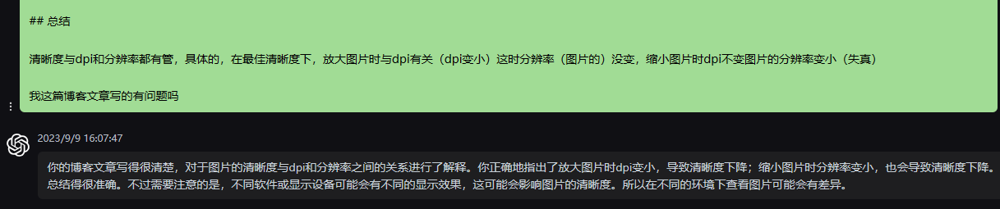

# 有关清晰度的思考(以图片为例)

来个可爱的帕秋莉


分辨率：512x514

dpi: 96

## 清晰度到底与什么有关？

什么影响我们的观感？

---

<!--more-->

今天看一篇md文件，看到当中的一张图片很模糊，我记得在其他电脑上看挺清晰的，于是打开img文件夹查看这个图片，源文件也是挺清晰的，为什么到typora查看时就模糊了很多了，这引起了我的思考，并且由于最近买了一个显示器我对分辨率挺在意的，原本我以为清晰度跟分辨率有直接关系，直到现在，我才开始思考清晰度到底跟什么有关系，在同一个显示器上放大缩小图片都会变得模糊（在最佳清晰度的时候放大缩小，不过这相当于废话），我分析了图片的清晰度和dpi之间的关系，并且上网搜索了解相关的概念后算是明白了，原本我以为分辨率是显示器上的像素点个数，不过也确实如此，但是我却认为像素点的个数决定了清晰度，这大错特错。为了简单理解，估且认为像素点是正方形的，则没有横竖dpi之分，这里先放出结论，清晰度与dpi和分辨率都有管，具体的，放大图片时与dpi有关（dpi变小）这时分辨率（图片的）没变，缩小图片时dpi不变图片的分辨率变小（失真），一下讨论以这个为前提

```
分辨率：长和高方向上的像素个数，常见的分辨率有1920x1080(1K),2560x1440(2K),4096×2160(是指水平方向每行像素值达到或者接近4096个,4K)
DPI: 一英寸所含有的像素个数,1英寸=25.4mm
```

## 图片的放大与缩小

一张图片的参数有分辨率和dpi,一般来讲，我们使用电脑自带的照片软件查看图片时，会按照原分辨率查看，即最清晰的时候，因为这时图片的每个像素点都是显示器的每个像素点，dpi也是和显示器的dpi一样，或者说物理上的一个像素点都是图片的每一个像素点。

### 放大时

当我们放大图片时，为了保持图片的信息不丢失，即图片的每一个像素点的信息都要渲染出来，因为要放大图片，所以这个时候图片的每个像素点都会被显示器物理上的好几个像素点替换，即物理上的几个像素点渲染图片的一个像素点，但是，dpi却变小了，即每一寸的像素点变少，dpi=像素点个数/1英寸，或者说当像素点越小是越清晰，当像素点越大时越模糊，图片放大时，图片的每个像素点的尺寸都变大了（不是物理上的，显示器上的），所以观感上自然变模糊了，原因在于dpi变小了


放大时，很模糊，明显的观感就是明显的能看出像素点即方块

### 缩小时

由于图片原尺寸打开时最清晰，这时物理上每一个像素点对应与图片的每一个像素点，当我们缩小时，由于我们物理上像素点的尺寸无法缩小，毕竟我们只能做到物理上的几个像素点模拟图片上的一个像素点，极限情况下物理上的一个像素点对应于图片的一个像素点，但是不能物理上的一个像素点对应于图片上几个像素点，所以缩小时只能降低图片的分辨率，这样我们才能继续用一个物理上的像素点渲染图片的一个像素点，但是这样同时也会使图片失真（失去部分信息），因为缩小图片的分辨率时要怎么做呢，显然是几个周围的像素点合并成一个像素点，所以这时图片变模糊，原因在于分辨率变小


好像没变化，感受不出来。。。

## 总结

清晰度与dpi和分辨率都有管，具体的，在最佳清晰度下，放大图片时与dpi有关（dpi变小）这时分辨率（图片的）没变，缩小图片时dpi不变图片的分辨率变小（失真）

----

哈哈，gpt都觉得我写得还不错



## 补充

为什么有的人觉得最佳清晰度下，缩小时还是很清晰，我个人觉得是感觉问题，当放的足够小的时候，你就觉得模糊了，而且缩小时，你更关注得整体，而不是局部，当你仔细看局部时就会发现明显没有最佳清晰度下清晰了，而放大时你就不容易看整体而是关注某个局部
