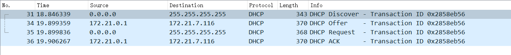
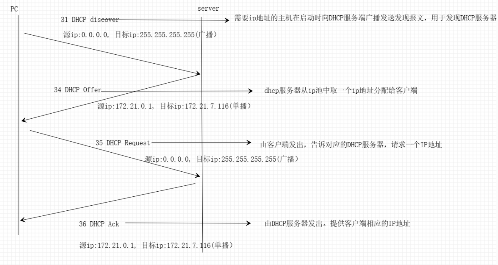
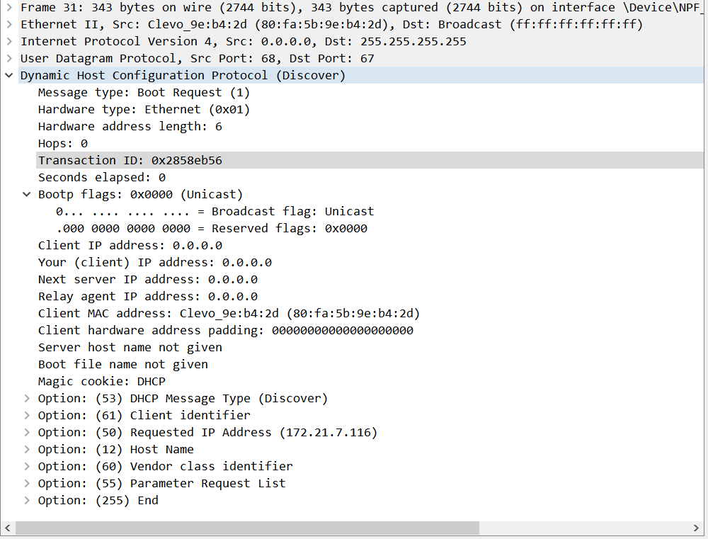
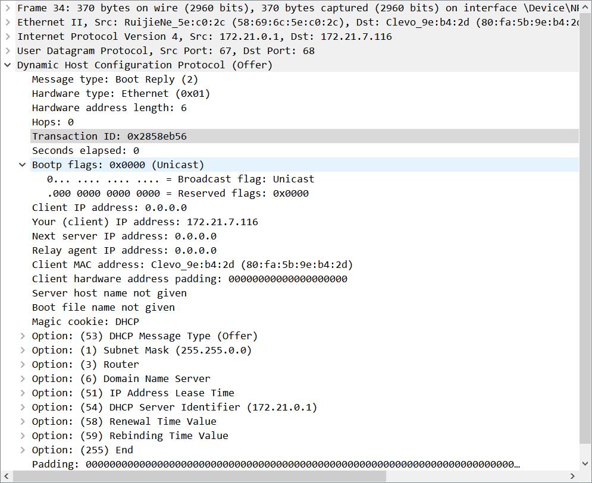
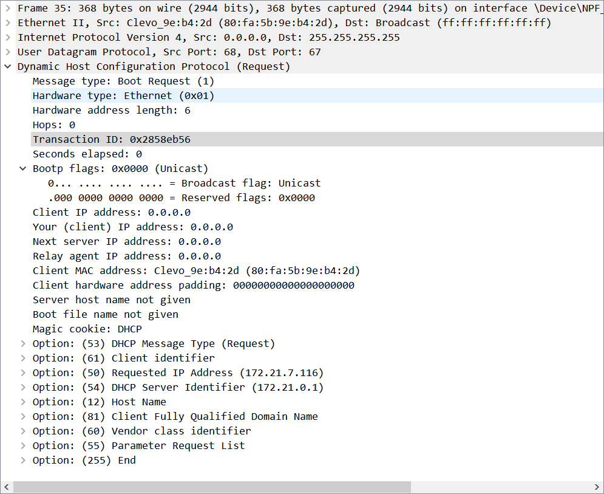
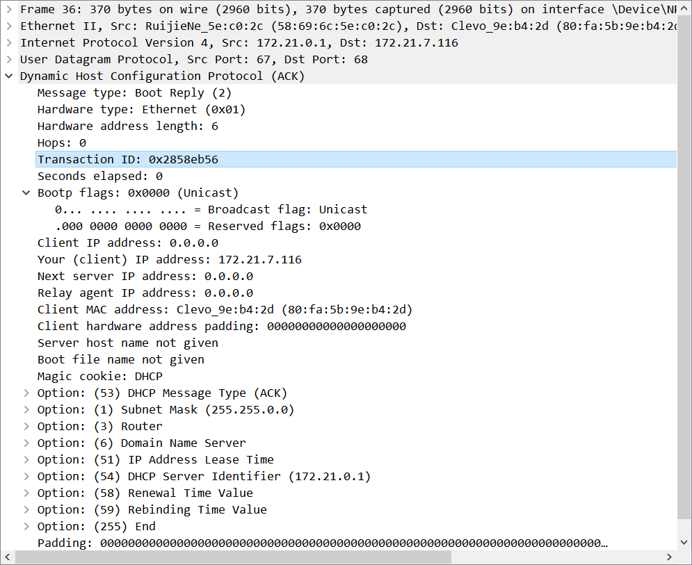

实验：网络仿真软件使用及网络分析

# 1. 基本信息

|  姓名  |     学号     |   班级   | 本次是否有抄袭 | 所选协议 |
| :----: | :----------: | :------: | :------------: | :------: |
| 余永海 | 202121331117 | 计算2114 |       否       |   DHCP   |

# 2. 使用Cisco Packet Tracer遇到的问题及解决方法

1. 两个终端设备无法发送报文，原因在于他们之间没有建立联系，连上线就行了

# 3. Wireshark抓取报文

**（1）如何抓取到你所选择的协议报文**

DHCP协议用于动态管理和获取ip地址等上网信息配置，所以我们可以在电脑开机时抓取报文或者重启以太网适配器或者在cmd终端输入相关的命令来达到同样的效果

**（2）Wireshark出来很多报文，你是如何过滤出与你所选协议相关的报文**

要从Wireshark中过滤出DHCP报文，可以使用过滤器“bootp”，因为DHCP是基于BOOTP开发的。具体的过滤器表达式为“bootp.option.dhcp == 1”或者'bootp'也行。在捕获数据包时，输入该过滤器表达式后，Wireshark就会仅显示DHCP请求和响应报文。

# 4. 协议时序图

Wireshark捕获到的报文如下图：

协议工作原理的时序图：

# 5. 分析协议工作原理

DHCP协议自动分配IP的报文主要有四种：

1. DHCP Discover：由客户端发出，用来发现DHCP服务器。

2. DHCP Offer：由DHCP服务器发出，告诉客户端，我可以提供IP地址。

3. DHCP Request：由客户端发出，告诉对应的DHCP服务器，我需要IP地址。

4. DHCP ACK：由DHCP服务器发出，提供客户端响应的IP地址。

## 5.1.DHCP  Discover:

Discover报文:

dhcp discover是新设备需要上网时发送的报文，dhcp是处于应用层,所以dhcp discover 实际上是应用层报文。 发送dhcp discover报文的目的是寻找本地的dhcp服务器。

从图中可以看出dhcp在传输层使用的是udp协议，而源端口即客户端端口使用的是68端口，目的端口即服务器端口是使用的是67端口. 

网络层里，由于设备刚开始还无法上网,没有IP地址，这里用0.0.0.0表示，而由于也不知道dhcp服务器的ip地址，所以要进行广播，目的ip地址为255.255.255.255，表示在本地进行广播用于发现dhcp服务器.

接下来的数据链路层最重要的是mac地址，源mac地址就是本机mac地址，目的mac地址由于不知道dhcp服务器，所以和网络层类似填写的是mac广播地址.

我们还可以看出应用层报文还有 transaction ID，事务ID，这个 ID 值是由客户端提供的随机数。如果有其他设备也在进行 DHCP 交互， 有这个事务ID 就能更好判断是属于这个设备的请求了。另外，因为 DHCP 是基于 boot protocol 发展出来的，因此在报文里会看到 bootp 或者 boot 这样的字样。这里 bootp flags 设置为 Unicus 的意思是服务器可以单播发送给设备，也就是不用广播进行发送。

从图中的option选项中还有一点值得注意，这里的requested ip address是172.21.7.116,这是我们这台设备上次使用的ip地址，即dhcp discover可能会请求上次使用的ip地址。

DHCB discover 这一步完成以后，如果此时网络中有 DHCP 服务器存在，就会进行处理，也就是进行 DHCP offer 这一步。

## 5.2.DHCP offer:

Offer报文:

 从图中可以看出，DHCP服务器 会提供上网所需的配置信息,也就是 ip 地址（127.21.7.116）、子网掩码（255.255.0.0）。除此之外在这一步还有ip 地址的租期，当租用过了某段时间就会过期，所以在到期前需要进行续租，还会提供续租的时间。

在传输层里依旧使用 UDP 协议，只是源端口和目标端口号反了过来，因为这次是服务端发送给客户端。  

网络层里，dhcp服务器的源ip为172.21.0.1，而目的ip是172.21.7.116为分配的ip地址,这两个我们也可以从数据包里的your ip address和dhcp server identifiter可以看到，还有其他的一些信息，如子网掩码:255.255.0.0

数据链路层里，源 Mac 地址就是dhcp服务器的mac地址，而目标 Mac 地址就是我们设备的。

## 5.3.DHCP Request:

Request报文:

当我们的设备接收到dhcp服务器的offer报文时，可能不止一个，如果网络里有多个dhcp服务器，则接收第一个offer报文提供的ip地址，并再次以广播的形式正式请求之前的ip,也告知其它dhcp服务器选择了哪一个dhcp服务器提供的ip地址，从图也可以看出，网络层源ip和目的ip和dhcp discover报文一样，传输层和数据链路层也同样.

## 5.4.DHCP ACK:

ACK报文:

在收到dhcp request报文时，服务器向客户端发送DHCP ACK报文,确认客户端可以使用请求的IP地址。从图中也可以看到

源MAC地址:58 69 6c 5e 0c 2c(服务端Mac地址)

目的MAC地址:80 fa 5b 9e b4 2d (客户端MAC)

交易ID:0x2858eb(与Request、Offer报文中的ID对应)

其他配置与Offer报文中的相同。至此,DHCP分配IP地址流程完成。客户端可以使用该IP地址并更新其配置开始上网了。

以上就是一个完整的DHCP IP地址分配过程的报文交互和分析。客户端通过Discover寻找服务器,选择一个Offer后,通过Request请求IP,最后服务器ACK确认分配,完成整个DHCP流程。

# 6. 遇到的问题及解决方法

1. 没有问题